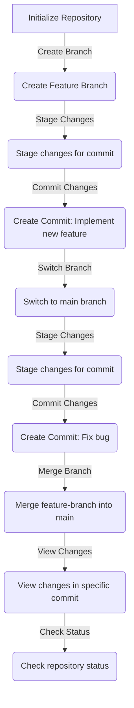

# Sulin Js Git Framework Documentation

This documentation provides details on using the Git-Like Framework, a JavaScript framework inspired by Git.





## 1. Repository Class

The `Repository` class represents a code repository. It includes basic functionalities like creating branches, committing changes, switching branches, viewing commit history, and checking the status.

### Usage Example:

```javascript
const myRepository = new Repository();
myRepository.createBranch('feature-branch');
myRepository.commit('John Doe', 'Implement new feature');
myRepository.switchBranch('main');
myRepository.commit('Jane Smith', 'Fix bug');
myRepository.log();
myRepository.status();
```

## 2.Branch Class

The `Branch` class handles branch-related operations such as creating branches and switching between them.

### Usage Example:

```Javascript
const featureBranch = new Branch(myRepository, 'feature-branch');
featureBranch.create();
featureBranch.switchBranch();
```

### Commit Class

The `Commit` class manages commit-related actions, including staging changes and creating commits.

### Usage Example:

```Javascript
const myCommit = new Commit(myRepository, 'John Doe', 'Implement new feature');
myCommit.stage({ file1: 'modified', file2: 'added' });
myCommit.commit();
```

## 4. Status Class
The Status class provides information about the current state of the repository, including the current branch, staging area, and working directory.

### Usage Example:

```Javascript
const myStatus = new Status(myRepository);
myStatus.display();
```

## 5. Merge Class

The Merge class handles branch merging operations.

### Usage Example:

```javascript
const myMerge = new Merge(myRepository);
myMerge.merge('feature-branch', 'main');
```

## 6. Diff Class

The Diff class allows users to view changes introduced in a specific commit.

###Usage Example:

```javascript
const myDiff = new Diff(myRepository);
myDiff.showChanges(2);
```
